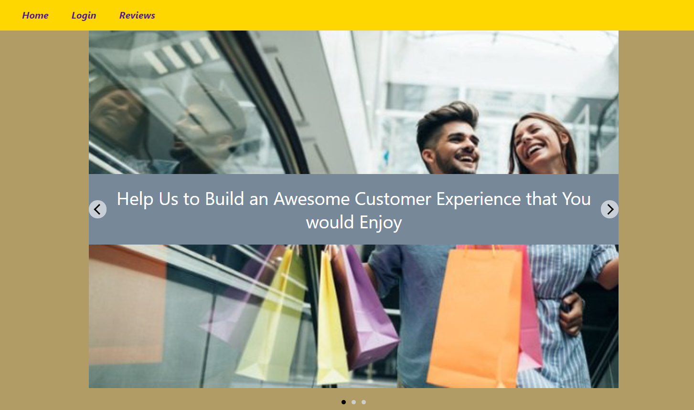
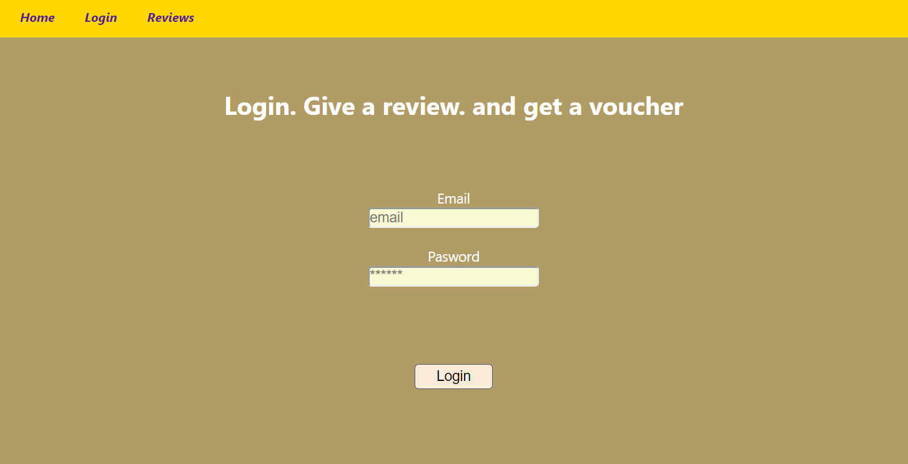
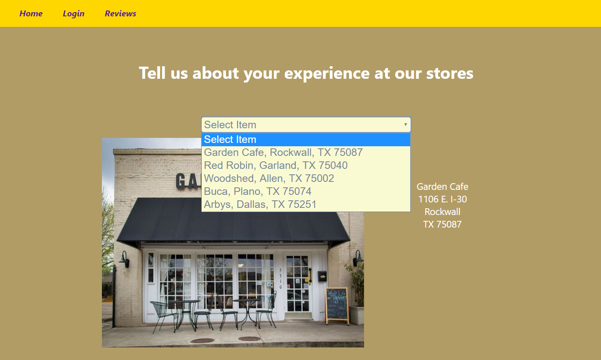
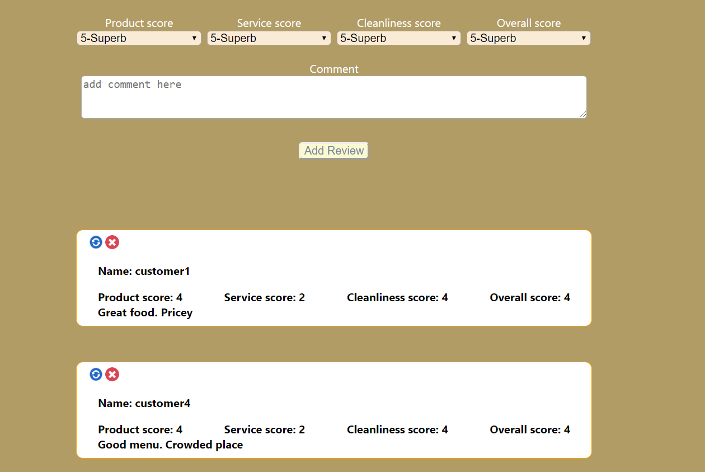
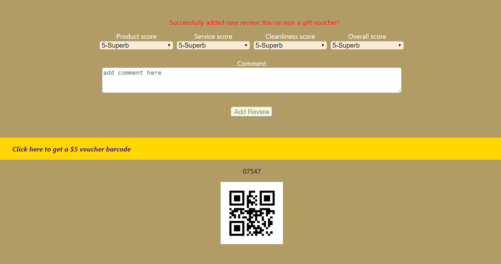

# Rate-my-store-app
#
# Problem Statement
### Provide a full stack application implementation for customer loyalty programs for stores, e.g. restuarants, shops, etc. Allow customers to rate product, serivce, cleanliness and overall scores of individual stores, to support building of customer experience and brands. 
# 
# Target users
### Retail customers who can rate the stores they have visited and provides feedback. Stackholders who have vested interests in managing and improving their stores's brand and business.
# 
# Wireframe
### Home

### Login

### Reviews

### Review list

### Barcode

# 
# Components
### Stateful components
#### App.js - Nav bar. Carousel.
#### Login.js - Login and autheticate
#### Reviews.js - Review list and API calls for CRUD operations
#### SelectList.js - Generator of select list dynamically
# 
### Functional components
#### Home.js - landing page with rendering shown App.js
#### Rewards.js - API calls for voucher barcode generation
# 
# API used: 
### 1) Barcode generation: https://quickchart.io/qr
### 2) Backend database CRUD operationss
#
# Baseline Technologies
### Frontend: Reactjs, React Router, Axios/AJAX
### Backend: Spring Boot w/ Maven as build tool, MVC architecture, Postgres SQL database
#
# Technologies used additionally
### Express.js server backend as image file server 
### Authentication using Postgres
### React-slideshow to graphically illustrate the business concept in home page
### react-scroll-into-view to scroll to point of interest
### Axios for API calls
#
# CRUD operations
### Create new review  
### Read a customer for a given email for authentication
### Read a list of stores to create the drop down select list
### Read a list of reviews for a selected store
### Update a review of given id
### Delete a review of given id
#
#